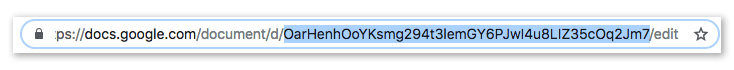
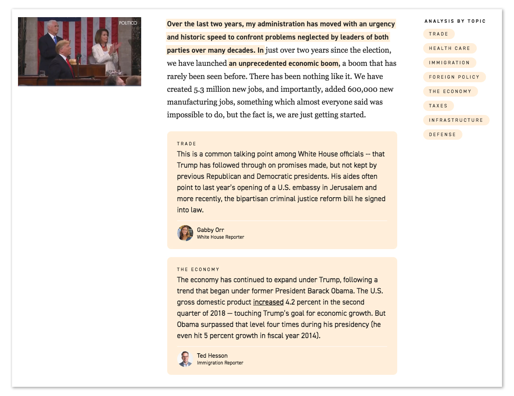

# GSpan.js

Transcribe and annotate C-Span closed captions in Google.

- [Why This?](#why-this)
- [How It works](how-it-works)
- [Quick Start](#quick-start)
- [Authenticating](#authenticating)
- [Demo](#demo)
- [API Documentation](#api-documentation)
- [Guides](#guides)

## Why This?

Providing context and fact checks are traditional tasks of the journalist. Perhaps once there was an era where they could simply provide that information and be trusted, but in an increasingly hyperlinked world transparency has become vital. Linking to the primary source is always a good start, but in 2019 we believe we can do better than that: we can provide that information in line with the primary source.

This of course comes with technical challenges (especially when the primary source is a live event happening concurrently with the fact checking). Google has solved the challenged of synchronous document editing in a way very few platforms have even attempted. They've also created a pretty solid way to comment on text in that document. And finally, they've done very well in making sure everyone has a Google account.

At POLITICO we've leveraged this to create in all-in-one system for getting live captions into a document where multiple editors and reporters can provide vital information about a speech, hearing, press release, court filing, etc. We can then combine the original document and the context provided by journalists into a usable data product.

## How It Works

GSpan comes with two main features that are designed to work together: [transcription](docs/TranscribingToADoc.md) and [downloading/parsing]((docs/DownloadingADoc.md).

GSpan uses [Opened Captions](https://openedcaptions.com/) created by [Dan Schultz](https://twitter.com/slifty) as the source of the transcription. You can [read more about the Opened Captions project on Source](https://source.opennews.org/articles/introducing-opened-captions/). These captions are written into a Google Doc where your users can [use the native commenting functionality to annotate documents](docs/AnnotatingDocs.md).

Once annotations are done you can convert that Google Doc (with all its annotations) into [structured data](docs/DataSignature.md) using GSpan's download functionality.

What you do with that data and how your page looks is up to you, but [here's what we did](#demo).


## Quick Start

Install the package globally to use the CLI

```
$ npm install -g gspan
```

Create a [Google Doc](https://www.google.com/docs/about/). Share it with your Google service account's client email (see [Authenticating](#authenticating)). Get the Doc ID for that document. You can find it in the URL between `d/` and `/edit` like this:



With an ID in hand you can begin transcribing and downloading with the CLI.

##### Transcribing from C-Span into a Google Doc

```
gspan transcribe <doc>

Begins transcribing CSPAN into a document.

Positionals:
  doc  The Google Doc ID                                     [string] [required]

Options:
  --verbose, -v     Log new entries in the console                     [boolean]
  --backfill, -b    Start from a saved backup file                     [boolean]
  --backupFile, -f  A filepath to save a backup                         [string]
```

##### Downloading and parsing data from a Google Doc

```
gspan download <doc> [output]

Downloads a GSpan doc as a JSON file.

Positionals:
  doc     The Google Doc ID                                  [string] [required]
  output  The directory to save the file to                             [string]

Options:
  --authorAPI, -a           A link to an authors API                    [string]
  --authorNameAccessor, -n  Accessor for Google display name            [string]
  --authorIdAccessor, -i    Accessor for unique ID                      [string]
  --defaultPublish, -p      Default for annoation published state      [boolean]
```

<em>* Boolean arguments can be set to false by setting them equal to false or by adding the `no-` prefix to their name. (e.g. `gspan transcribe DOC_ID --no-verbose` or `gspan download DOC_ID -p=false`)</em>


## Authenticating

In order to use this app you'll need a Google Service Account which has write access to your Google Doc. For help with creating a Google Service Account, see [Making A Google Service Account](docs/GoogleServiceAccount.md).

Once you have your credentials file, you'll need the `client_email` and `private_key`. You'll need to make sure that these are saved as environment variables in your runtime under the keys of `GAPI_CLIENT_EMAIL` and `GAPI_PRIVATE_KEY` respectively.

There's a number of ways to do this depending on your workflow. If you've never worked with environment variables in node check out [this guide](https://www.twilio.com/blog/2017/08/working-with-environment-variables-in-node-js.html).

Finally, also make sure to share the Google Doc you're using with the `client_email`. It may look long and not like a valid email, but Google will allow it.

## Demo
Our inaugural use of GSpan was for the 2019 State of the Union. Check out the [page](https://www.politico.com/interactives/2019/trump-state-of-the-union-2019-live-fact-check-transcript-2/5/19/) and [data](https://www.politico.com/interactives/2019/trump-state-of-the-union-2019-live-fact-check-transcript-2/5/19/data/data.json) data that powered it.

<a href="https://www.politico.com/interactives/2019/trump-state-of-the-union-2019-live-fact-check-transcript-2/5/19/"></a>

## API Documentation
- [Transcribing To A Doc](docs/TranscribingToADoc.md): API reference for GSpan transcribe.
- [Downloading A Doc](docs/DownloadingADoc.md): API reference for GSpan download.
- [The Data Signature](docs/DataSignature.md): API Reference for the output of GSpan download.

## Guides

#### For Users
- [Annotating Docs](docs/AnnotatingDocs.md): A guide to making the annotations in a Google Doc.
- [Advanced Annotating](docs/Advanced.md): A guide for handling some of the fringe cases.

#### For Developers
- [Formatting Comments](docs/FormattingComments.md): A guide to formatting rich text annoations and the markdown output they produce.
- [Making A Google Service Account](docs/GoogleServiceAccount.md): A guide to setting up a Google service account and getting your credentials.
