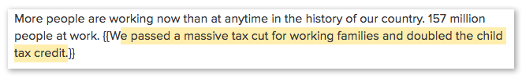
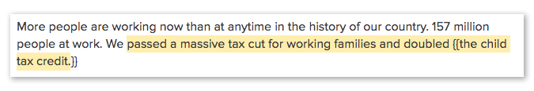
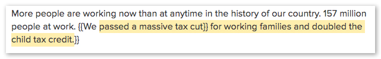
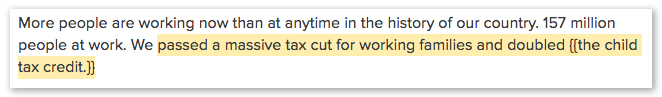

# Advanced Annotating
There is some functionality we've added to address some of the more "rough around the edges" parts of this system.

- [Overriding Comment Locations](#overriding-comment-locations)
- [Using Square Brackets](#using-square-brackets)

## Overriding Comment Locations
For a number of reasons (some known to us and some not so much) highlight locations can be slightly off. This may also be caused by human error. Maybe the user forgot a word in their highlight.

As a way to fix this we've added the ability to override the content that is "highlighted". If you wrap text in the doc with double curly braces (`{{ }}`) like this:

✅



You can use the opening curly brace anywhere you'd like within that same paragrah. This can be used to truncate the starting point like this:

✅



There are some limitations though that come from the way the Google API works. The closing curly braces HAS to be outside of the in-document highlight. For example, this doesn't work:

❌



It doesn't work because the closing curly brace is inside the highlight. If you need to truncate the end of the highlight for some reason, you'll need to delete the comment and make it again.

Be very careful of putting the closing braces as the last character within the highlight. That won't work either.

**THE CLOSING BRACES MUST NOT BE HIGHLIGHTED.**

❌



In some strange cases we haven't yet figured out, even these overrides can be slightly off. If this is unacceptable for your situation, usually deleting the comment and remaking it will fix the problem.

## Using Square Brackets

Square brackets in the document can cause problems because of the way the Google API works. If you have a single word inside square brackets you should escape the first square bracket like this:

```
He \[Obama] was president of the United States.
```

If the content is more than one word, there's no need to escape it.
```
He [Barack Obama] was president of the United States.
```
