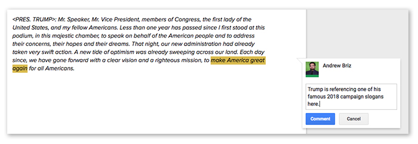
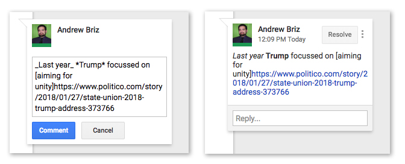
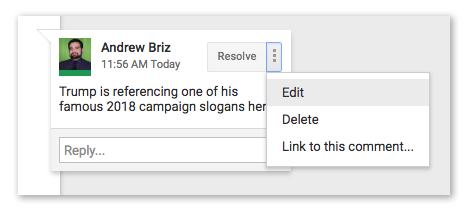
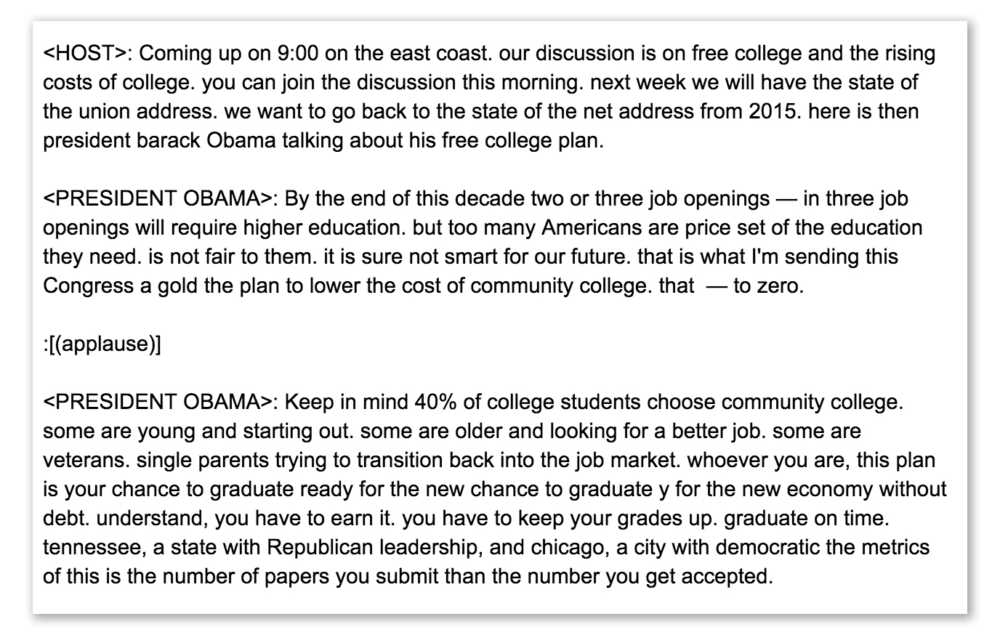
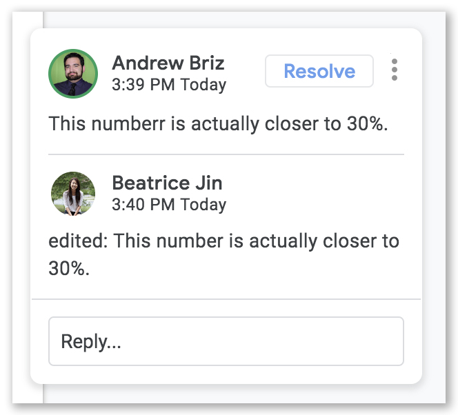
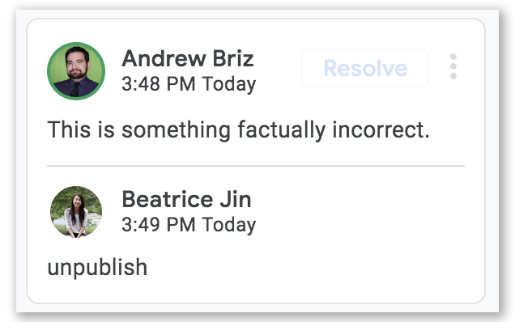
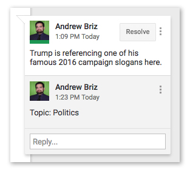

# Annotating A Google Doc

Once you've got a live transcript being fed into a Google Doc (see [Transcribing To A Doc](TranscribingToADoc.md)) or you have content pasted in the doc you can begin annoating it.

Maintaining live annotations often involves two roles: annotating and editing. The docs below are broken down for those two roles.

## Annotators

#### Creating Annotations

Comments you make in the document will be published as a live annotation. Once content starts coming in you'll see something like this:

<blockquote>
&lt;PRES. TRUMP&gt;: Mr. Speaker, Mr. Vice President, members of Congress, the first lady of the United States, and my fellow Americans. Less than one year has passed since I first stood at this podium, in this majestic chamber, to speak on behalf of the American people and to address their concerns, their hopes and their dreams. That night, our new administration had already taken very swift action. A new tide of optimism was already sweeping across our land. Each day since, we have gone forward with a clear vision and a righteous mission, to make America great again for all Americans.
</blockquote>

To make a comment, highlight the part of the paragraph you want to make a comment on and click the button that appears to the right. Write your annotation and click "Comment".



#### Formatting Your Annotations

You can get a little fancy with your annotations if you need to. You can <b>\*bold\*</b> words by wrapping them in asterisks (`*`) and <em>\_italicize\_</em> words by using underscores (`_`).

You can also paste links into an annotation, but you should use our special syntax to shorten long URLs. Put square brackets (`[]`) around word(s) you want to link. Then, paste the link, with no spaces between it and the bracket:

```
[Trump's State of the Union aims for unity after a polarizing year]https://www.politico.com/story/2018/01/27/state-union-2018-trump-address-373766
```



<em>
\*\*Developers should see [Formatting Comments](FormattingComments.md) for more about the data structure these formatting options produce.
</em>


#### Editing / Deleting Your Annotations
If you need edit or delete your annotation, you can click the three dots in the top right corner to bring up those options.



## Editors

While a transcript is live you'll see something like this:



#### Line Breaks

The transcription service keeps a paragraph going until there's a speaker change or a soundbite. You probably want to break up that long text into smaller paragraphs which you can do with a simple line break. There's no need to indicate the speaker in a new paragraph unless there was a change.

#### Creating Speaker Changes or Soundbites
C-Span will mark speakers and sound bites automatically. Do not delete them.

Speaker changes are indicated by starting a paragraph with the speaker's name wrapped in angle brackets (`<>`) and followed by a colon (`:`). It'll look something like this:

```
<PRES. TRUMP>:
```

Sound bites are their own paragraphs which are wrapped in square brackets (`[]`) and preceded by a colon (`:`). It'll look something like this:

```
:[(applause)]
```

#### Editing Other's Annotations

Google does not allow you to edit reporters comments directly. **Do not click resolve.**

If you need to make an edit to a comment, you can reply to the comment in the form:

```
edited: TK TK the new text here
```

Your new edit will override the original commenter's annotation, but keep his/her name. In the Google doc it will look like this:



You can keep adding new edits, and the system will respect the last one made.

####  Deleting Other's Annotations
If you need to delete an annotation for some reason, reply to a comment with just the word `unpublish`.  This will remove the comment from our page, but keep it in the Google Doc. If you made the original comment, you can also just delete it.



If a comment was unpublished and you're ready to publish it again reply to the comment with just the word `publish`. You can keep replying with `unpublish` / `publish` as much as you'd like. The last one used will be respected.

#### Assigning Tags
Tags can be added to a comment by replying:

```
tag_name: TK TK TK
```

For example, at POLITICO we use the `topic` tag. So we would assign a topic to a comment by replying:

```
topic: Immigration
```


