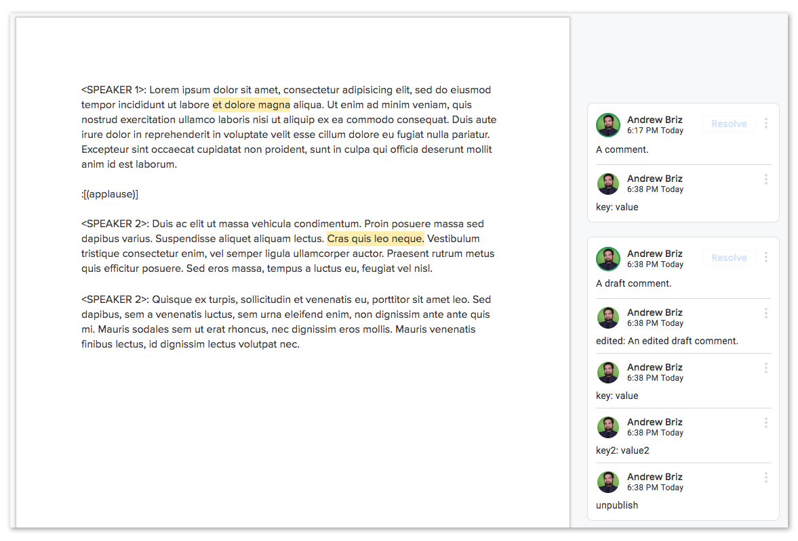

# What The Data Looks Like

GSpan download outputs an object with two keys.

| Property | Type| Description |
| --- | --- | -- |
| [users](#users) | Object | An object with unique IDs of all the active users referenced in the annotations |
| content | Object\[\] | An array of [content objects](#the-content-object) |

## Users
Users is an object with unique IDs of all the active users referenced in the annotations. Each key represents data for a specific user. By default, GSpan uses the user data provided by the Google API.

| Property | Type | Description |
| --- | --- | --- |
| displayName | string | The name of the user |
| photoLink | string | A URL to the user's profile photo |
| kind | string | Always `"drive#user"` |
| me | boolean | Always `false` |

If you've configured an external authors API, this data will match the data from that API for the appropriate user. See [Connecting to An External Authors API](DownloadingADoc.md#connecting-to-an-external-authors-api) for more.

## The Content Object
Content objects are objects representing text in the Google Doc.

| Property | Type |Description |
| --- | --- | -- |
| id | string | Unique identifiers generated from their value and (in the case of duplication) their index in the content array
| [type](#type--value) | string | The type of object |
| [value](#type--value) | string | The text of the object |
| annotations | Object\[\] | An array of [annotation objects](#the-annotation-object) |

### Type & Value
There are three types of content object. The only difference is what their `value` represents:

| Type | Value
| --- | --- |
| attribution | The name of the speaker |
| soundbite | The text of the soundbite |
| content* | The text of the paragraph |

<em>* Yes, one type of content object is called content. Apologies for any confusion this may cause.</em>

### The Annotation Object
Annotation objects are objects representing comments made on content in the Google Doc.

| Property | Type |Description |
| --- | --- | -- |
| id | string | Unique identifiers generated by the Google Comments API
| author | string | An ID that will match a property in the `users` object. |
| text | string | The final text of the annotation after any edits have taken place (see [Editing Annotations](AnnotatingDocs.md#editing-others-annotations)). These will be parsed using a custom text parser (see [Formatting Comments](docs/FormattingComments.md)). |
| tags | Object | Tags assigned to the annotation. See [Assigning Tags](AnnotatingDocs.md#assigning-tags).  |
| [published](#published) | boolean | Whether an annotation is published |
| [location](#location) | integer\[\] | The start and end location of the annotation |
| original | String | The original text of the annotation (only present if an annotation has been edited)|

#### Published
Publish status is set to the `publishDefault` (see [Downloading A Parsed Doc](docs/DownloadingADoc.md)). It can be explicity set to `true` or `false` by replying `publish` or `unpublish`. See [Deleting Other's Annotations](AnnotatingDocs.md#deleting-others-annotations) for more.

#### Location
The location of the annotation is saved as a start and end point relative to the parent content value. The first value of this array is the position where the highlight starts. The second value is the position (up to, but not including) where the highlight ends. This format is used so that (given the example photo above) this code works:

```javascript
const block = {
  "type": "content",
  "value": "Lorem ipsum dolor sit amet, consectetur adipisicing elit, sed do eiusmod tempor incididunt ut labore et dolore magna aliqua. Ut enim ad minim veniam, quis nostrud exercitation ullamco laboris nisi ut aliquip ex ea commodo consequat. Duis aute irure dolor in reprehenderit in voluptate velit esse cillum dolore eu fugiat nulla pariatur. Excepteur sint occaecat cupidatat non proident, sunt in culpa qui officia deserunt mollit anim id est laborum.",
  "annotations": [
    {
      "id": "AAAAChQtmA0",
      "author": "Andrew Briz",
      "text": "A comment.",
      "tags": {
        "key": "value"
      },
      "published": true,
      "location": [
        101,
        116
      ]
    }
  ],
  "id": "fa5c89f3c88b81bfd5e821b0316569af"
};

const loc = block.annotations[0].location;
const highlighted = block.value.substring(loc[0], loc[1]);


// if using the ES6 spread operator...
const highlightedSpread = block.value.substring(...loc);

console.log(highlighted);
// expected: "et dolore magna"

console.log(highlighted === highlightedSpread)
// expected: true
```

## Example

Given an annotated Google Doc that looks like this:



The parsed data will look like this:

```javascript
{
  "users": {
    "Andrew Briz": {
      "kind": "drive#user",
      "displayName": "Andrew Briz",
      "photoLink": "//lh3.googleusercontent.com/a-/AAuE7mBO9mjHMIvQ0Ja4mXCbm1r3R5Sl66FyCT-arfkWCg=s96-k-no",
      "me": false
    }
  },
  "content": [
    {
      "type": "attribution",
      "value": "SPEAKER 1",
      "annotations": [],
      "id": "27de876452788f6b6e2818bcbe31cd9a"
    },
    {
      "type": "content",
      "value": "Lorem ipsum dolor sit amet, consectetur adipisicing elit, sed do eiusmod tempor incididunt ut labore et dolore magna aliqua. Ut enim ad minim veniam, quis nostrud exercitation ullamco laboris nisi ut aliquip ex ea commodo consequat. Duis aute irure dolor in reprehenderit in voluptate velit esse cillum dolore eu fugiat nulla pariatur. Excepteur sint occaecat cupidatat non proident, sunt in culpa qui officia deserunt mollit anim id est laborum.",
      "annotations": [
        {
          "id": "AAAAChQtmA0",
          "author": "Andrew Briz",
          "text": "A comment.",
          "tags": {
            "key": "value"
          },
          "published": true,
          "location": [
            101,
            116
          ]
        }
      ],
      "id": "fa5c89f3c88b81bfd5e821b0316569af"
    },
    {
      "type": "soundbite",
      "value": "(applause)", // this is everything inside the square brackets, including the parentheses
      "annotations": [],
      "id": "12afe57843d6ed0f35e165b16d854860"
    },
    {
      "type": "attribution",
      "value": "SPEAKER 2",
      "annotations": [],
      "id": "9109a65f5f3d2f897aed98e591082619"
    },
    {
      "type": "content",
      "value": "Duis ac elit ut massa vehicula condimentum. Proin posuere massa sed dapibus varius. Suspendisse aliquet aliquam lectus. Cras quis leo neque. Vestibulum tristique consectetur enim, vel semper ligula ullamcorper auctor. Praesent rutrum metus quis efficitur posuere. Sed eros massa, tempus a luctus eu, feugiat vel nisl.",
      "annotations": [
        {
          "id": "AAAAChQuchI",
          "author": "Andrew Briz",
          "text": "An edited draft comment.",
          "tags": {
            "key": "value",
            "key2": "value2"
          },
          "published": false, // "publish" is set to false because of the "unpublish" reply
          "location": [
            120,
            140
          ],
          "original": "A draft comment." // The annotation was edited so there is an "original" key
        }
      ],
      "id": "b439c27194e132903f7006b7d4e07b36"
    },

    // note that if a speaker doesn't change, no attribution block is exported
    // even if one exists in the Google Doc

    {
      "type": "content",
      "value": "Quisque ex turpis, sollicitudin et venenatis eu, porttitor sit amet leo. Sed dapibus, sem a venenatis luctus, sem urna eleifend enim, non dignissim ante ante quis mi. Mauris sodales sem ut erat rhoncus, nec dignissim eros mollis. Mauris venenatis finibus lectus, id dignissim lectus volutpat nec.",
      "annotations": [],
      "id": "f238d2990c2804fdeb4b16351e1cb111"
    }
  ]
}
```
