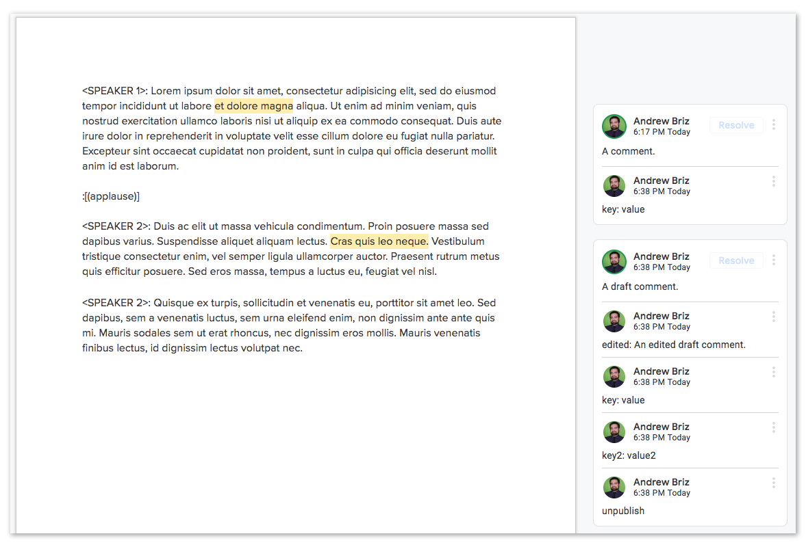

# Downloading A Parsed Doc

One of the main features of GSpan is its ability to download a specially formatted Google Doc, parse it for annotations, and export the result as JSON.

## The Data

First up, let's look at the data GSpan will return. Given a Google Doc that looks like this:



The data will look like this:

```javascript
{
  //  all authors with annotations will go here
  "users": {
    "Andrew Briz": {
      "kind": "drive#user",
      "displayName": "Andrew Briz",
      "photoLink": "//lh3.googleusercontent.com/a-/AAuE7mBO9mjHMIvQ0Ja4mXCbm1r3R5Sl66FyCT-arfkWCg=s96-k-no",
      "me": false
    }
  },
   // content is an array with different types of content blocks
  "content": [
    {
      // content type 1/3: "attribution" represents changes in speakers
      "type": "attribution",
      // value will be the name of the attribution
      "value": "SPEAKER 1",
      "annotations": [],
      // content block IDs are generated via their value and (in the case of duplication) their index in the content array
      "id": "27de876452788f6b6e2818bcbe31cd9a"
    },
    {
      // content type 2/3: "content" represents regular blocks of text
      "type": "content",
      // value will be the text of the paragraph
      "value": "Lorem ipsum dolor sit amet, consectetur adipisicing elit, sed do eiusmod tempor incididunt ut labore et dolore magna aliqua. Ut enim ad minim veniam, quis nostrud exercitation ullamco laboris nisi ut aliquip ex ea commodo consequat. Duis aute irure dolor in reprehenderit in voluptate velit esse cillum dolore eu fugiat nulla pariatur. Excepteur sint occaecat cupidatat non proident, sunt in culpa qui officia deserunt mollit anim id est laborum.",
      // annotations is an array of comments in order of the content they're highlighting
      "annotations": [
        {
          // annotation IDs are generated by the Google Comments API
          "id": "AAAAChQtmA0",
          // The author here will always match with a key in users
          "author": "Andrew Briz",
          // The final text of the comment (after any edits)
          "text": "A comment.",
          // Extra keys can be provided to provide data about the comment
          "tags": {
            "key": "value"
          },
          // Whether this comment should be published
          "published": true,
          // The location of the comment (see below)
          "location": [
            101,
            116
          ]
        }
      ],
      "id": "fa5c89f3c88b81bfd5e821b0316569af"
    },
    {
      // content type 3/3: "soundbite" represents a soundbite seen in the caption
      "type": "soundbite",
      // value will be the text of the soundbite
      "value": "(applause)",
      "annotations": [],
      "id": "12afe57843d6ed0f35e165b16d854860"
    },
    {
      "type": "attribution",
      "value": "SPEAKER 2",
      "annotations": [],
      "id": "9109a65f5f3d2f897aed98e591082619"
    },
    {
      "type": "content",
      "value": "Duis ac elit ut massa vehicula condimentum. Proin posuere massa sed dapibus varius. Suspendisse aliquet aliquam lectus. Cras quis leo neque. Vestibulum tristique consectetur enim, vel semper ligula ullamcorper auctor. Praesent rutrum metus quis efficitur posuere. Sed eros massa, tempus a luctus eu, feugiat vel nisl.",
      "annotations": [
        {
          "id": "AAAAChQuchI",
          "author": "Andrew Briz",
          "text": "An edited draft comment.",
          "tags": {
            "key": "value",
            "key2": "value2"
          },
          // publish is set to false because of the "unpublish" reply
          "published": false,
          "location": [
            120,
            140
          ],
          // if a comment was edited, the original comment text will be preserved in "original". The user will remain the information for the original creator of the annotation
          "original": "A draft comment."
        }
      ],
      "id": "b439c27194e132903f7006b7d4e07b36"
    },

    // note that if a speaker doesn't change, no attribution block is exported
    // even if one exists in the Google Doc

    {
      "type": "content",
      "value": "Quisque ex turpis, sollicitudin et venenatis eu, porttitor sit amet leo. Sed dapibus, sem a venenatis luctus, sem urna eleifend enim, non dignissim ante ante quis mi. Mauris sodales sem ut erat rhoncus, nec dignissim eros mollis. Mauris venenatis finibus lectus, id dignissim lectus volutpat nec.",
      "annotations": [],
      "id": "f238d2990c2804fdeb4b16351e1cb111"
    }
  ]
}
```

 `users` is an object with unique IDs of all the active users referenced in the annotations. `content` is an array of content objects with a `type`, a `value`, and `annotations` which are comments made about the content object.

Annotations is an array of comments made about that content in the Google Doc. They have a `text` key which is the value of the comment. These will be parsed using a custom text parser (see [Formatting Comments](./FormattingComments.md)).

These annotations have `publish` set the `publishDefault` (see arguments below). They can be set to `true` by replying `publish` or to `false` by replying `unpublish`. The last `publish` / `unpublish` replied will be respected.

Annotators can also reply with a `key: value` syntax to create a set of `tags` for that annotations.

`author` is an ID that will match with the `users` object.

Finally, the location of the highlighted text is available in the `location` array. The first value of this array is the position where the highlight starts. First character is at index 0. The second value is the position (up to, but not including) where to end the highlight. This format is used so that (given the example photo above) this code works:

```javascript
const block = {
  "type": "content",
  "value": "Lorem ipsum dolor sit amet, consectetur adipisicing elit, sed do eiusmod tempor incididunt ut labore et dolore magna aliqua. Ut enim ad minim veniam, quis nostrud exercitation ullamco laboris nisi ut aliquip ex ea commodo consequat. Duis aute irure dolor in reprehenderit in voluptate velit esse cillum dolore eu fugiat nulla pariatur. Excepteur sint occaecat cupidatat non proident, sunt in culpa qui officia deserunt mollit anim id est laborum.",
  "annotations": [
    {
      "id": "AAAAChQtmA0",
      "author": "Andrew Briz",
      "text": "A comment.",
      "tags": {
        "key": "value"
      },
      "published": true,
      "location": [
        101,
        116
      ]
    }
  ],
  "id": "fa5c89f3c88b81bfd5e821b0316569af"
};

const loc = block.annotations[0].location;
const highlighted = block.value.substring(loc[0], loc[1]);


// if using es6 spread operator...
const highlightedSpread = block.value.substring(...loc);

console.log(highlighted);
// expected: "et dolore magna"

console.log(highlighted === highlightedSpread)
// expected: true
```

## Downloading Data From A Google Doc

There's a few ways GSpan can download data from a Google Doc:

- [As A Globally-Installed CLI](#as-a-globally-installed-cli)
- [As An NPM Script In A Package](#as-an-npm-script-in-a-package)
- [As An API Inside Node.js](#as-an-api-inside-node.js)

First though, let's go over the things each method has in common: it's arguments. Take a quick look at the table below and reference it as you go throughout the rest of this doc.

### GSpan Download Arguments Quick Reference

| Name | Description | Type | Required / Default | CLI Position / Alias |
| ---|---| ---|
| `doc` | The Google Doc's ID | String | **Required** | First
| `output` | The output directory for the GSpan data. Provide a [falsy](https://developer.mozilla.org/en-US/docs/Glossary/Falsy) value to instead have the function return the data as a JSON object | String | None | Second
| `defaultPublish`| The default value each annotation's publish key should be set to if there is no `publish` or `unpublish` reply  | Boolean | true | -p |
| `authorAPI`* | A link to an external authors API | String (URL) | None | -a
| `authorNameAccessor`* | A [Lodash accessor](https://lodash.com/docs/4.17.11#get) that points to the key in your data that should match with Google's display name | String | "displayName" | -n |
| `authorIdAccessor`* | A Lodash accessor that points to a property unique for each author | String | "displayName" | -i |

<em>* Google's native Author system doesn't provide more than a name and a Google profile photo. To make up for this shortcoming, GSpan's authors are configurable using these three arguments. See [Connecting to An External Authors API](#connecting-to-an-external-authors-api) for more.</em>

## As A Globally-Installed CLI
If you've installed GSpan as a global package you can use it as a CLI from any directory in your terminal using:

```
$ gspan download <doc> [output]
```

Not providing a `output` will log the output to the console. This can be used to pipe the result into another file or another command:

```
$ gspan download MY_DOC_ID > data.json
```

You can also supply the other arguments using their aliases or names:

```
$ gspan download MY_DOC_ID -p=false --authorAPI="https://example.com/staff/"
```


## As An NPM Script In A Package
If you've installed GSpan as a package in a node project you can use the CLI in your node scripts like this:

```javascript
// package.json
{
  ...

  "scripts": {
    "download": "gspan download <doc> [output]"
  }

  ...
}
```

And then run the download with:

```
$ npm run download
```

Just like with the global CLI you can choose to omit the `output` argument or provide extra arguments with their names or aliases. For more on creating npm scripts check out [the official docs.](https://docs.npmjs.com/misc/scripts)

## As An API Inside Node.js
If you have it installed in the node runtime you're using you can import Gspan and run its `download` function.

If a directory is provided it will return a promise which resolves when the file has been saved. If no directory is provided, it will return a promise which resolves with the Gspan data.

```javascript
import gspan from 'gspan';

/* Without an output directory */
gspan.download('GOOGLE_DOC_ID').then(data => {
  // do something with data
});

/***************************/

/* With an output directory */
gspan.download('GOOGLE_DOC_ID', 'FILEPATH').then(() => {
  // the file is now saved...
});

```

Arguments other than `doc` and `output` can be supplied using the function's third argument. It should be an object with keys matching the names of the options.

```javascript
import gspan from 'gspan';

gspan.download('GOOGLE_DOC_ID', null,
  {
    defaultPublish: false,
    authorAPI: 'https://example.com/staff/'
  }).then(data => {
  // do something with data
});

```

## Connecting to An External Authors API
Unfortunately Google's API does not provide much data on commenters. For that GSpan has a way to connect to an external Author API as long as the data in that App has a display name that matches up with their Google Plus display name.

### Configuring Your Authors API
Your API should return an array that looks something like this:

```json
[
  {
    "id": "ezbwzhvrcw",
    "displayName": "Andrew Briz",
    "otherKey": "value",
    "otherKeyTwo": "value"
  },
  {
    "id": "ihgkgdchol",
    "displayName": "Jon McClure",
    "otherKey": "value",
    "otherKeyTwo": "value"
  },
]
```

Using the example API above, you could run GSpan like this:

```
$ gspan download GOOGLE_DOC_ID data.json -a "https://example.com/staff/" -n displayName -i id
```

or

```javascript
import gspan from 'gspan';

gspan.download('GOOGLE_DOC_ID', null, {
  authorAPI: "https://example.com/staff/",
  authorNameAccessor: "displayName",
  authorIdAccessor: "id"
}).then(data => {
  // do something with data
})
```

Which will create data that looks like:

```json
{
  "users": {
    "ezbwzhvrcw": {
      "id": "ezbwzhvrcw",
      "displayName": "Andrew Briz",
      "otherKey": "value",
      "otherKeyTwo": "value"
    }
  },
  "content": [
    {
      "type": "content",
      "value": "Lorem ipsum dolor sit amet.",
      "annotations": [
        {
          "id": "AAAACewA71Q",
          "author": "ezbwzhvrcw",
          "text": "Test",
          "tags": {},
          "published": true,
          "location": [
            0,
            5
          ]
        }
      ]
    }
  ]
}
```
