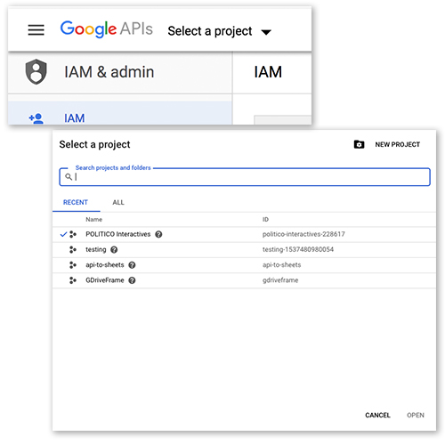
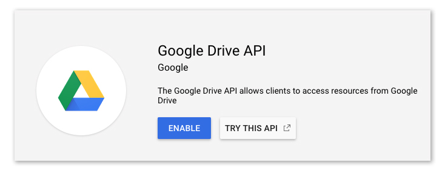
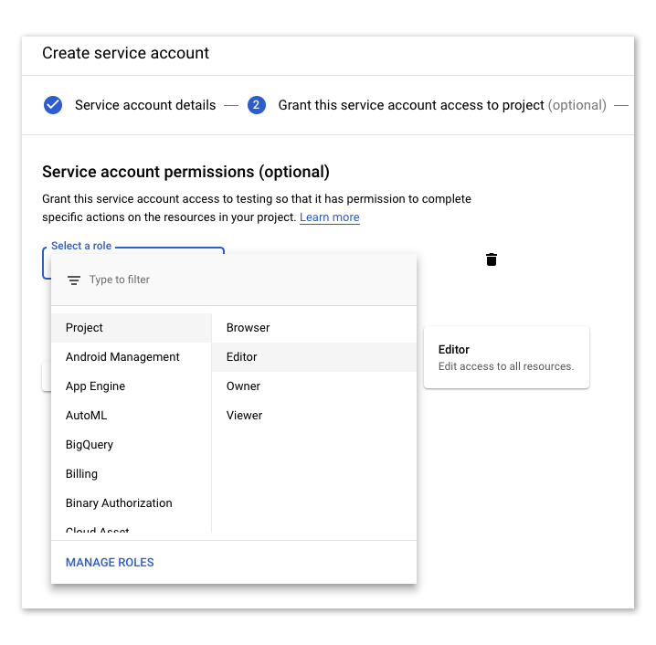

# Making A Google Service Account
In order to use this app, you're going to need to set up a service account in the Google API. This account will serve to handle permissions for individual files. Think of it as the Gmail account for a bot that runs this API.

Want that bot to have access to a document? Share it with it. Want it to have access to a whole directory of documents automatically? You can share the directory with the bot too, and any document made in it will be automatically shared.

## Making A Google Developer Project
To make a new service account, first you'll need a project in the developer console. Go to [the developer console](https://console.developers.google.com/iam-admin/iam) to get started.

At the top left you should either see a project name (if you've used this console before) or a prompt to `Select a project`. Clicking on it will open a new window showing your projects. Click `New Project`.

Give your new project a name and click `Create`.

## Giving Your Service Account Some Power

In order for your service account to be able to do things, you need to enable certain APIs for your project. The two you'll need for GSpan are Drive and Docs.

Go to the [Google Drive API](https://console.developers.google.com/apis/library/drive.googleapis.com) and make sure you have the right project selected (the selected project name is located at the top left of your screen next to "Google APIs"). Click `Enable`.

Then, do the same for the [Google Docs API](https://console.developers.google.com/apis/library/docs.googleapis.com). Go the the link and click `Enable`. At the time of writing this API is very new and may be missing an icon and description.

## Making A Service Account
Once you have that project selected, you can make a new service account. Click the hamburger menu on the top left, hover over `IAM & admin`, and click `Service accounts`.

Click `Create Service Account`, give it a name and override the ID if you'd like (it will autofill based on the name). The ID will be combined with your project name to create a valid Google account.

Once you're done, click `Create`. In the next screen, give it the role of `Editor` (under `Project`) and click `Continue`. I'll be honest, I'm not 100% versed on this complicated permissions system. It's possible that Editor is more permission than this project needs or should have, but I know it works.

In the final step, you can ignore the `Grant users access to this service account` and instead click `Create Key`. Choose `JSON` as the `Key type` and then click `Create`. This will give you a one-time credentials file which you should keep in a safe place. If you lose it you can create a new set of keys but you'll never be able get the original credentials from this console after it's been created.

In this file you'll find a `private_key` and a `client_email` which you'll need to have set as `GAPI_PRIVATE_KEY` and `GAPI_CLIENT_EMAIL` respectively in your node environment (see the [README](../README.md) for more on how to do that).
